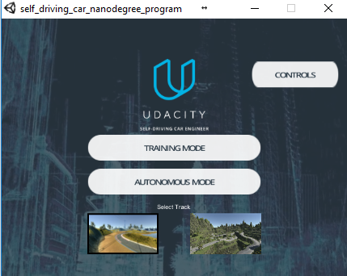

Behaviorial Cloning Project
===========================

<http://www.udacity.com/drive>

Overview
--------

I have build a Convolutional Neural Network and Neural network to clone driving
behavior.

 

I have trained, validated and tested the model using Keras and Tensorflow.

 

My model model will output a steering angle to an autonomous vehicle.

 

For the data collection I have used a simulator provided by Udacity:

Here the links to download:

-   [Linux](https://d17h27t6h515a5.cloudfront.net/topher/2017/February/58ae46bb_linux-sim/linux-sim.zip)

-   [macOS](https://d17h27t6h515a5.cloudfront.net/topher/2017/February/58ae4594_mac-sim.app/mac-sim.app.zip)

-   [Windows](https://d17h27t6h515a5.cloudfront.net/topher/2017/February/58ae4419_windows-sim/windows-sim.zip)

With this simulator you can steer a car around a track for data collection. The
data collected consists of a .csv and a subfolder with the images taken while
driving.

In the .csv there are 4 columns, center/left/right image location and steering
angle.

 

I have then You'll use image data and steering angles to train a neural network
and then use this model to drive the car autonomously around the track.

 

Please check the **writeup.md**, where the steps toward the final result are
explained in details.

 

The Project
-----------

 

The goals / steps of this project are the following:

-   Use the simulator to collect data of good driving behavior

-   Design, train and validate a model that predicts a steering angle from image
    data

-   Use the model to drive the vehicle autonomously around the first track in
    the simulator. The vehicle should remain on the road for an entire loop
    around the track.

    

-   Summarize the results with a written report

 

### Dependencies

**Anaconda environment:**

-   [CarND Term1 Starter
    Kit](https://github.com/udacity/CarND-Term1-Starter-Kit)

    The lab enviroment can be created with CarND Term1 Starter Kit. Click
    [here](https://github.com/udacity/CarND-Term1-Starter-Kit/blob/master/README.md)
    for the details.

 

The following resources can be found in this github repository: \* drive.py \*
video.py \* writeup_template.mdl.

 

**Link for the Simulator:**

-   [Linux](https://d17h27t6h515a5.cloudfront.net/topher/2017/February/58ae46bb_linux-sim/linux-sim.zip)

-   [macOS](https://d17h27t6h515a5.cloudfront.net/topher/2017/February/58ae4594_mac-sim.app/mac-sim.app.zip)

-   [Windows](https://d17h27t6h515a5.cloudfront.net/topher/2017/February/58ae4419_windows-sim/windows-sim.zip)

 

Details About Files In This Directory
-------------------------------------

-   `drive.py`

    Usage of `drive.py` requires you have saved the trained model as an h5 file,
    i.e. `model.h5`.

    Once the model has been saved, it can be used with drive.py using this
    command:

    ~~~~~~~~~~~~~~~~~~~~~~~~~~~~~~~~~~~~~~~~~~~~~~~~~~~~~~~~~~~~~~~~~~~~~~~~~ sh
    python drive.py model.h5
    ~~~~~~~~~~~~~~~~~~~~~~~~~~~~~~~~~~~~~~~~~~~~~~~~~~~~~~~~~~~~~~~~~~~~~~~~~~~~

    The above command will load the trained model and use the model to make
    predictions on individual images in real-time and send the predicted angle
    back to the server via a websocket connection.

    Note: There is known local system's setting issue with replacing "," with
    "." when using drive.py. When this happens it can make predicted steering
    values clipped to max/min values. If this occurs, a known fix for this is to
    add "export LANG=en_US.utf8" to the bashrc file.

###### Saving a video of the autonomous agent

~~~~~~~~~~~~~~~~~~~~~~~~~~~~~~~~~~~~~~~~~~~~~~~~~~~~~~~~~~~~~~~~~~~~~~~~~~~~~ sh
python drive.py model.h5 run1
~~~~~~~~~~~~~~~~~~~~~~~~~~~~~~~~~~~~~~~~~~~~~~~~~~~~~~~~~~~~~~~~~~~~~~~~~~~~~~~~

The fourth argument, `run1`, is the directory in which to save the images seen
by the agent. If the directory already exists, it'll be overwritten.

~~~~~~~~~~~~~~~~~~~~~~~~~~~~~~~~~~~~~~~~~~~~~~~~~~~~~~~~~~~~~~~~~~~~~~~~~~~~~ sh
ls run1

[2017-01-09 16:10:23 EST]  12KiB 2017_01_09_21_10_23_424.jpg
[2017-01-09 16:10:23 EST]  12KiB 2017_01_09_21_10_23_451.jpg
[2017-01-09 16:10:23 EST]  12KiB 2017_01_09_21_10_23_477.jpg
[2017-01-09 16:10:23 EST]  12KiB 2017_01_09_21_10_23_528.jpg
[2017-01-09 16:10:23 EST]  12KiB 2017_01_09_21_10_23_573.jpg
[2017-01-09 16:10:23 EST]  12KiB 2017_01_09_21_10_23_618.jpg
[2017-01-09 16:10:23 EST]  12KiB 2017_01_09_21_10_23_697.jpg
[2017-01-09 16:10:23 EST]  12KiB 2017_01_09_21_10_23_723.jpg
[2017-01-09 16:10:23 EST]  12KiB 2017_01_09_21_10_23_749.jpg
[2017-01-09 16:10:23 EST]  12KiB 2017_01_09_21_10_23_817.jpg
...
~~~~~~~~~~~~~~~~~~~~~~~~~~~~~~~~~~~~~~~~~~~~~~~~~~~~~~~~~~~~~~~~~~~~~~~~~~~~~~~~

The image file name is a timestamp of when the image was seen. This information
is used by `video.py` to create a chronological video of the agent driving.

-   `video.py`

    ~~~~~~~~~~~~~~~~~~~~~~~~~~~~~~~~~~~~~~~~~~~~~~~~~~~~~~~~~~~~~~~~~~~~~~~~~ sh
    python video.py run1
    ~~~~~~~~~~~~~~~~~~~~~~~~~~~~~~~~~~~~~~~~~~~~~~~~~~~~~~~~~~~~~~~~~~~~~~~~~~~~

    Creates a video based on images found in the `run1` directory. The name of
    the video will be the name of the directory followed by `'.mp4'`, so, in
    this case the video will be `run1.mp4`.

    Optionally, one can specify the FPS (frames per second) of the video:

    ~~~~~~~~~~~~~~~~~~~~~~~~~~~~~~~~~~~~~~~~~~~~~~~~~~~~~~~~~~~~~~~~~~~~~~~~~ sh
    python video.py run1 --fps 48
    ~~~~~~~~~~~~~~~~~~~~~~~~~~~~~~~~~~~~~~~~~~~~~~~~~~~~~~~~~~~~~~~~~~~~~~~~~~~~

    Will run the video at 48 FPS. The default FPS is 60.

###### Why create a video

1.  It's been noted the simulator might perform differently based on the
    hardware. So if your model drives succesfully on your machine it might not
    on another machine (your reviewer). Saving a video is a solid backup in case
    this happens.

    1.  You could slightly alter the code in `drive.py` and/or `video.py` to
        create a video of what your model sees after the image is processed (may
        be helpful for debugging).

-   `model.ipynb`

    Here you can find my implementation of the Image preprocessing, Design,
    Traing and Validate Convolutional Neural Network.

-   `model.pdf`

    An already executed version of model.ipynb

-   `model.h5`

    The generated trained model

-   `writeup_report.md`

    Here I have described step by step my strategies to resolve this Project

-   `video.mp4`

    The generated output as a chronological video of the agent driving.

-   `model_partitioned.ipynb`

    Same as the model.ipynb, but with performance tuning, expecially with Big
    Data.

    Here I am using multiple loaders of a async Queue where the generator is
    picking up the data for Keras. There is still a problem , something related
    with the data shuffle. It doesnt train correctly, the loss after first epoch
    stabilize and doesnt go low.

-   `test_images folder`

    Here I have two images, used to visualize the Model after been trained

-   `data folder`

    Local data folder **not** synchronized with GitHub.

    Here I am storing the data sampled from the simulator.

    I have modified the original structure.

    The .csv contains the relative path ex. :
    **run1/center_2017_10_14_00_18_50_634.jpg**

    There are now multiple subfolders, each one containing a different sample
    batch:

    ~~~~~~~~~~~~~~~~~~~~~~~~~~~~~~~~~~~~~~~~~~~~~~~~~~~~~~~~~~~~~~~~~~~~~~~~~~~~
    total 5180
    drwxrwxr-x 2 cristianku cristianku 393216 ott 14 00:22 run1
    drwxrwxr-x 2 cristianku cristianku 266240 ott 14 13:01 run2
    drwxrwxr-x 2 cristianku cristianku 655360 ott 15 21:14 run3
    drwxrwxr-x 2 cristianku cristianku 577536 ott 16 13:09 run4
    drwxrwxr-x 2 cristianku cristianku 720896 ott 17 09:11 track1_run1
    drwxrwxr-x 2 cristianku cristianku 323584 ott 18 12:33 run5
    ~~~~~~~~~~~~~~~~~~~~~~~~~~~~~~~~~~~~~~~~~~~~~~~~~~~~~~~~~~~~~~~~~~~~~~~~~~~~

    ... and multiple .csv’s:

    ~~~~~~~~~~~~~~~~~~~~~~~~~~~~~~~~~~~~~~~~~~~~~~~~~~~~~~~~~~~~~~~~~~~~~~~~~~~~
    -rw-rw-r-- 1 cristianku cristianku 295164 ott 14 00:24 run1.csv
    -rw-rw-r-- 1 cristianku cristianku 214413 ott 14 13:02 run2.csv
    -rw-rw-r-- 1 cristianku cristianku 512122 ott 15 21:16 run3.csv
    -rw-rw-r-- 1 cristianku cristianku 441046 ott 16 12:50 run4.csv
    -rw-rw-r-- 1 cristianku cristianku 657245 ott 17 09:13 track1_run1.csv
    -rw-rw-r-- 1 cristianku cristianku 231229 ott 18 12:35 run5.csv5
    ~~~~~~~~~~~~~~~~~~~~~~~~~~~~~~~~~~~~~~~~~~~~~~~~~~~~~~~~~~~~~~~~~~~~~~~~~~~~

     
